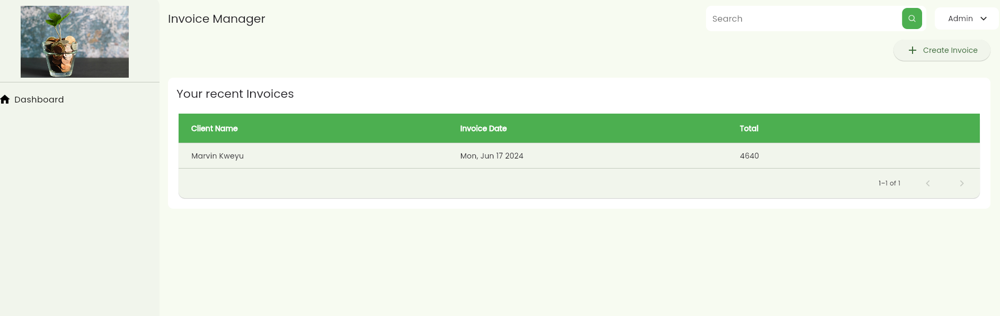
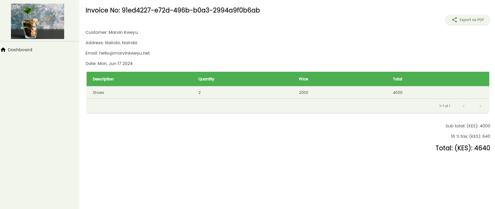

# MoneyUp

> Retail invoice management made easy

[](https://flutter.dev/)
[](https://bloclibrary.dev/)


MoneyUp is a retail invoice management prototype.

- [MoneyUp](#moneyup)
  - [Core features](#core-features)
  - [Preview](#preview)
    - [Main page](#main-page)
    - [Invoice information](#invoice-information)
  - [Development](#development)
    - [Getting Started](#getting-started)
    - [Running tests](#running-tests)


## Core features

 - Creation of an invoice
 - Viewing created invoices and their details
 - Export an invoice as a PDF
 - State persistence


## Preview

### Main page


### Invoice information


> An export of the invoice generated can be found in the preview folder.

## Development

### Getting Started

Clone the repo, install the required dependencies and run the app:

```bash
flutter pub get
flutter run -d chrome
```

### Running tests

```
flutter test
```